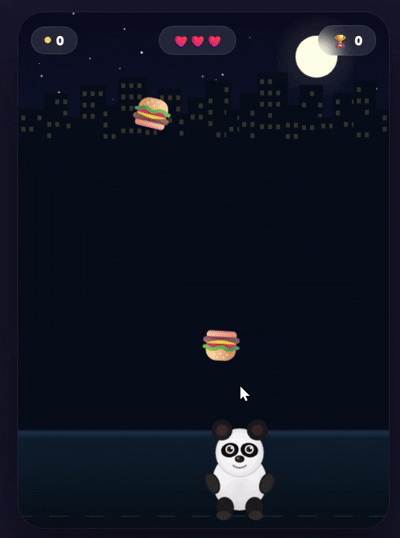

# 🐼 Hungry Panda — Catch the Burgers!

Hungry Panda is a fun and addictive browser-based catching game where you 
control a panda on a mission to eat as many burgers as possible!

Burgers, power-ups, and sneaky obstacles rain down from the night sky above 
a glowing city skyline. Move the panda left and right to catch every burger 
before it hits the ground — but dodge the veggies and junk!

## 🎮 Gameplay Preview



## 🎮 How to Play
- Move your **mouse** or use **← → arrow keys** to guide the panda
- Catch 🍔 burgers → **+1 point**
- Catch ⭐ golden burger → **+3 points + speed boost**
- Dodge 🥦 broccoli, 🗑️ trash, 🍆 eggplant → or **lose a life**
- You have **3 lives** — don't miss too many burgers!

## ✨ Features
- Hand-crafted animated panda with squish, blink & eating animations
- Night city skyline with twinkling stars
- Speed ramps up as your score increases
- Personal best tracker

## Play it Live
[Click here to play](https://gayathrii3.github.io/hungry-panda-game/)

## 🛠️ Built With
- HTML5 Canvas
- Vanilla JavaScript
- CSS3
```

 Save it (Ctrl+S)

Your folder should now look like this:

hungry-panda-game/<br>
├── index.html<br>
└── README.md
```
